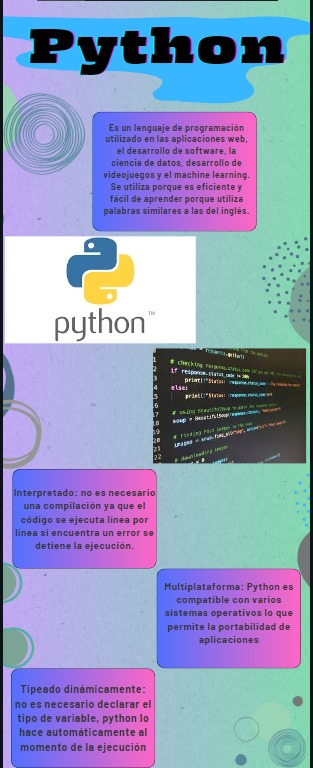
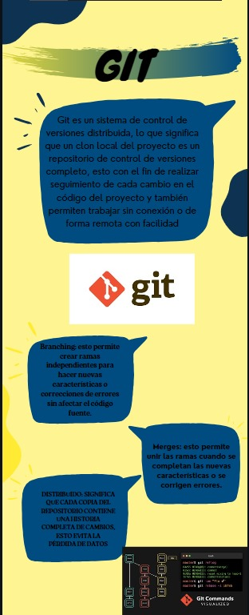
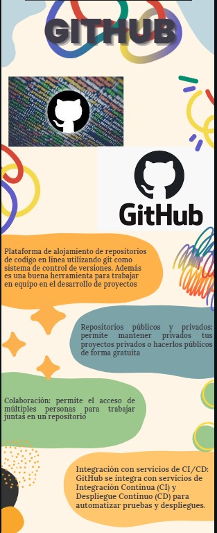

<!-- No borrar o modificar -->
[Inicio](./index.md)

## Sesión 1 

##### ¿Cuál es tu nivel de conocimiento de Python? (principiante, intermedio, avanzado) Explica brevemente.
- Principiante

##### ¿Has usado Git/GitHub antes? ¿Con qué frecuencia? (nunca, una o dos veces, varias veces)
- Varias veces

##### ¿Has escrito código en Python? ¿De qué tipo? (algoritmos simples, funciones, clases, librerías, proyectos completos)
- Algoritmos simples

##### Escribe un breve ejemplo de código Python que involucre al menos dos de los siguientes conceptos: funciones, clases, librerías.

'import math

def area_circulo(radio):
    area = math.pi * radio**2
    return area

radio = float(input("Ingrese el radio del círculo "))

area = area_circulo(radio)
print("El área del círculo con radio:", radio, " es:", area)'

##### Escribe los comandos de Git que conoces y una breve explicación de cada uno.
git init - Inicializa un repositorio local en la carpeta actual
git add . - Agrega todos los archivos al index para su posterior commit
git commit -m - "commit" -se agrega el commit
git clone enlace.repositorio - clona repositorio para trabajarlo local
git push origin master - subir cambios a github

## Actividad: Consulta y creación de infografía para cada tema: Python, Git y GitHub

<!-- Su documentación aquí -->

